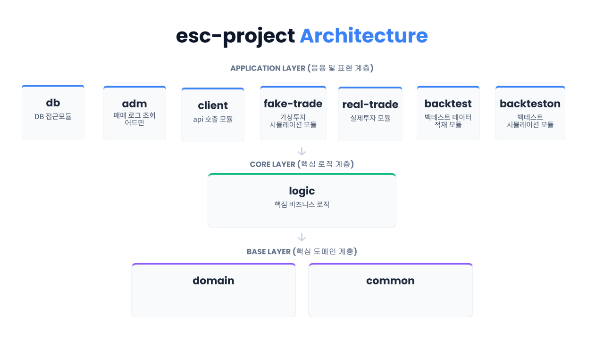

# esc-project | 국내주식 백테스팅 및 트레이딩 시스템(2025.05~)

## 프로젝트 한 줄 소개
국내주식 트레이딩 전략을 백테스트, 모의투자, 실거래까지 확장할 수 있도록 설계한 멀티모듈 백엔드 시스템입니다.
  
## 프로젝트 목적
한국투자증권 OpenAPI를 활용해, 국내 주식 종목 데이터를 적재하고 백테스팅 할 수 있는 시스템을 구축하였습니다.
또한, 구현된 지표를 조합하여 최적의 알고리즘 지표를 도출하도록 했으며 이를 바탕으로, 실시간 가상투자, 실매매 투자가 가능한 시스템을 구축하였습니다.
  
## 주요 기능
- 백테스트용 데이터 처리 및 전략 검증
- 구현된 매수 및 매도 전략의 모든 경우의수를 조합하여 승률 및 수익률 도출기능 구현
- 가상투자(Fake Trade)와 실거래(Real Trade) 모듈 분리
- 주문, 계정, 차트, 거래 로직을 공통 코어로 분리
- DB, 클라이언트, 관리자, 실거래 실행 모듈의 역할 분리
- 백테스트 알고리즘 및 매수/매도 시그널 분리
- WebFlux 기반 비동기 처리 구조 도입
  
## 시스템 구성도

  
## 백엔드 설계 포인트
### 1. 공통 코어와 실행 모듈 분리
주문, 계정, 차트, 거래 같은 핵심 도메인은 공통 모듈에 두고, 백테스트/가상투자/실거래는 실행 모듈로 분리했습니다. 이 구조를 통해 같은 전략을 서로 다른 실행 환경에 재사용하도록 했습니다.

### 2. 전략 검증 흐름 단순화
백테스트 전용 모듈과 실전 모듈을 분리해, 전략 변경 시 영향 범위를 줄이고 실험-검증-적용 흐름을 명확하게 만들었습니다.

### 3. 비동기 방식 및 기타 성능개선을 통한 속도개선
WebFlux 기반 비동기 처리를 활용하여 병목 현상을 줄이고자 했으며, 신호 탐지 및 매매까지의 소요 시간을 줄이기위해 노력했습니다.
  
## 기술 스택 및 구조
- Java 23, Spring Boot 3.4.x
- Spring WebFlux
- Spring Data JPA, Spring Data R2DBC, Redis
- MySQL, Thymeleaf
