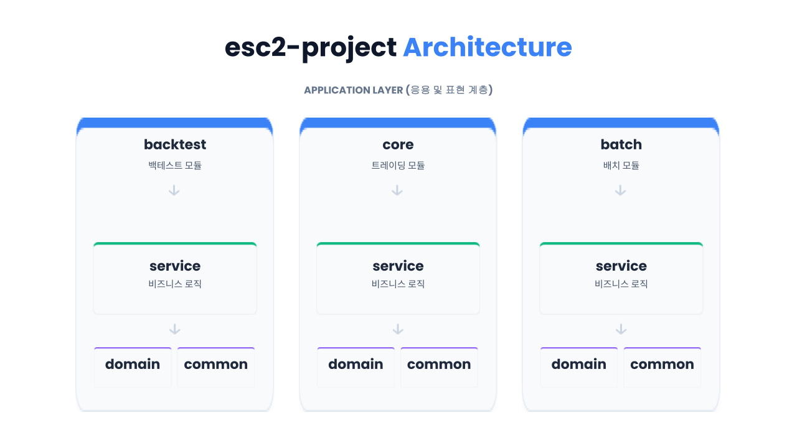

# esc2-project | 코인 트레이딩 백테스팅 및 가상투자 시스템(2025.12~)

## 프로젝트 한 줄 소개
바이낸스 OpenAPI 기반 코인 트레이딩 전략을 위한 캔들 수집, 백테스트, 모의투자, 실거래를 구현한 백엔드 시스템입니다.
  
## 프로젝트 목적
메이저 가상화폐의 레버리지 거래에 최적화된 전략을 백테스트, 모의투자, 실매매 거래가 가능한 시스템을 구축했습니다.
배치와 핵심 거래 로직을 나누고 체크포인트 기반 수집 구조를 적용해 24시간 운용에 필요한 안정성을 고려했습니다.
  

## 주요 기능
- 바이낸스 API 연동
- 캔들 수집, 체크포인트 관리, 캔들 병합 및 집계 배치
- 백테스트용 거래 전략 검증
- 가상계좌(Fake)와 실계좌(Real) 분리
- 주문, 체결, 포지션, 계좌 상태 관리
- 차트 지표로직 및 거래 로직 분리
  
## 시스템 구성도

  
## 백엔드 설계 포인트
### 1. 데이터 수집과 전략 실행의 분리
exit2-batch에서 캔들을 수집하고 집계하며, exit2-core는 주문/거래/계좌 같은 핵심 실행 로직을 담당합니다. 
이 분리를 통해 24시간 실행되는 실시간 매매 시스템에 안정성을 강화했습니다.

### 2. 체크포인트 기반 배치 처리
장시간 실행되는 배치 작업인 캔들 수집과 병합 과정에 체크포인트를 두어 중복 수집과 누락 가능성을 줄이도록 설계했습니다.

### 3. 실거래와 모의거래의 공통화
Fake 서비스와 Real 서비스를 분리하되, 인터페이스와 도메인 구조를 맞춰 전략 검증 후 운영 전환이 자연스럽도록 구성했습니다.
  
## 기술 스택 및 구조
- Java 23, Spring Boot 3.3.x
- Spring Web, Spring Data JPA
- MySQL, R2DBC, Redis
